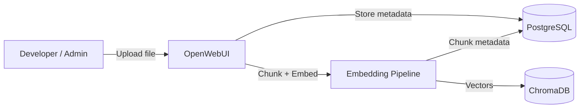
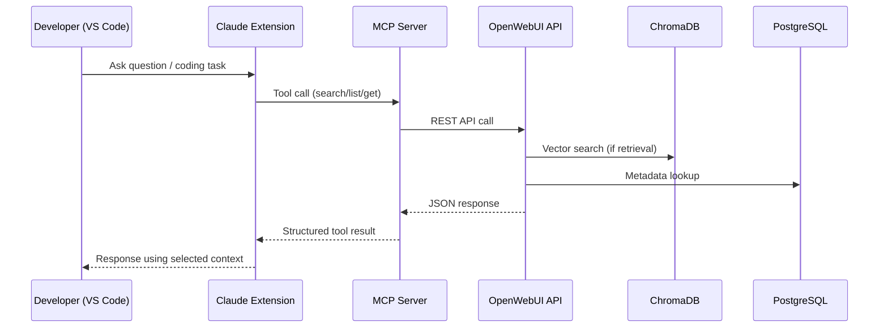

# work_rag — a self-hosted knowledge base for your own projects

A local RAG stack you run with `docker compose up`, plus an MCP server that lets
Claude query it from inside the editor. Nothing leaves the machine: documents,
embeddings and metadata all live in containers on localhost.

**It is general-purpose on purpose.** A collection is just a set of documents, so
the same stack holds whatever you need it to — a codebase's docs, hardware notes,
research papers, API references, meeting notes, a personal wiki. Add a collection,
point a tool at it, done. There is no schema to design and no project it is tied to.

## What problem it solves

Long-lived work loses context between sessions. The usual answers are bad in
opposite directions: paste everything into the prompt and pay for it every turn,
or paste nothing and re-derive what you already knew.

This stack is the third option. Documents are embedded once and retrieved on
demand, a few relevant chunks at a time, addressed by collection and file id. The
model asks for what it needs when it needs it.

## Stack

| Component | Role | Version |
| --- | --- | --- |
| OpenWebUI | ingestion, retrieval, chat UI, admin | `v0.11.3` |
| ChromaDB | vector storage and similarity search | `1.5.9` |
| PostgreSQL | collections, file metadata, config, chats | `15` |
| MCP server | tool interface for Claude (`mcp/openwebui-knowledge`) | local build |
| Embedding model | `BAAI/bge-m3` — 1024d, 8192-token context, multilingual | local, CPU |

Image tags are pinned in [docker-compose.yaml](docker-compose.yaml). Floating
tags like `:main` and `:latest` change silently under you; a pinned version means
an upgrade is a decision you make, not one that happens on the next `pull`.

## Quick start

```sh
cp .env.example .env          # fill in POSTGRES_*, WEBUI_ADMIN_*, WEBUI_SECRET_KEY
docker compose up -d
open http://localhost:3000    # create the admin account
```

Then, to let Claude reach it:

1. In OpenWebUI, enable **Settings → Admin → Users → Groups → Default
   permissions → Features → API Keys** (off by default — the create button
   returns 403 without it).
2. **Settings → Account → API Keys → Create.** Take the `sk-...` key, not the
   JWT shown above it: the JWT expires in four weeks and takes the integration
   down with it.
3. Put the key in `.env` as `OPENWEBUI_API_KEY`, set
   `OPENWEBUI_DEFAULT_COLLECTION` to the collection you query most, then
   `docker compose up -d --force-recreate openwebui-knowledge`.
4. Register the MCP server:

```sh
claude mcp add --scope user --transport http openwebui-knowledge http://localhost:8787/mcp
```

`WEBUI_SECRET_KEY` matters more than it looks: without a fixed value OpenWebUI
generates a new signing key on every restart and logs everyone out.

## Architecture

### Ingestion



| Component | Responsibility |
| --- | --- |
| OpenWebUI | Orchestrates ingestion and retrieval workflows |
| PostgreSQL | Stores collections, file metadata, and access data |
| ChromaDB | Stores embeddings and performs similarity search |

### Runtime



The MCP server speaks Streamable HTTP on `/mcp` and keeps the deprecated
HTTP+SSE transport on `/sse` for older clients.

## MCP tools

Every tool takes `collection` as either an id or a **name** — `"JIRA"` works
as well as the uuid, which matters because a model can produce a name and cannot
guess a uuid.

| Tool | Does |
| --- | --- |
| `ping_openwebui` | check the API is reachable and the key is valid |
| `list_collections` | collections, paged, `query` filters by name server-side |
| `list_documents` | files in a collection, with `total` and `has_more` |
| `get_document` | one file's text by `file_id`, clipped to `max_chars` |
| `select_context_files` | several files concatenated into one context block |
| `search_knowledge` | semantic search; `collection` or `collections` for several at once, `min_score` for the floor |
| `create_collection` | make a collection, or return the existing one of that name |
| `upload_document` | put text into a collection, by content |
| `upload_document_from_path` | the same, but the server reads the file off disk itself |
| `wait_pending` | block until a collection's embedding queue drains, or one file is linked |
| `dedupe_collection` | keep the newest file of each name, remove the rest; dry run by default |
| `remove_document` | take a file out of a collection — which also deletes it, see below |

`search_knowledge` filters hits below `min_score` (default `MIN_SCORE`, 0.76 here).
The floor is a property of the corpus, not of the stack: conversational text
scores systematically lower than curated prose, so pass `min_score` per call
rather than moving the default. Below the floor the tool says
`nothing_above_threshold` and reports `best_score_seen`, so a model can answer
"not in the knowledge base" instead of improvising from noise.

### Writing, and what "done" means

Uploads return as soon as OpenWebUI accepts them. Embedding continues in the
background, and **a file is linked to its collection only after it finishes** —
so a freshly uploaded document is briefly in neither `list_documents`' `files`
nor the search index. That is why `list_documents` also returns `pending`: a
document in `pending` is on its way in, and one in neither list is genuinely
absent. `settled: false` on an upload means the same thing. It is not a failure
and retrying on it uploads the document twice.

`wait_pending` is the way to wait for it: one blocking call until the queue is
empty, rather than a poll loop over `list_documents`. It defaults to 45 seconds
and caps at 55 — an MCP call over a bridge is cut at about 60, and the bridge's
own overhead takes several seconds of that, so 55 gets cut in practice. Call it
again if it returns `settled: false`.

`replace: true` cannot finish inside the call that asks for it. The previous
version may only be removed once the new one is linked — otherwise the collection
spends the whole embedding window with no copy of the document — and embedding a
160 KB file on CPU runs for minutes, well past any single RPC. So the replace
returns immediately with the old ids in `replace_pending`, and **the server
finishes the job on its own**, up to `OPENWEBUI_REPLACE_DEADLINE_MS` (15 min).
No second call, and no window in which both versions answer the same query. The
task lives in memory: if the process dies first the old version simply stays
attached, which is what used to happen every time.

**`settled: true` is not the same as "clean."** A replace that failed to remove
the old version, or never linked before its deadline, is *finished* — so it is
gone from `replace_pending` and the queue reads as empty. `wait_pending` also
returns `replace_done`, the last 20 finished replaces with their `linked` and
`detach_failed`, and sets `replace_incomplete` when one of them did not do
everything it promised. A server restart is the one case nothing can report:
that history is in memory too, so a replace interrupted by a restart leaves two
versions attached and no record of it. `dedupe_collection` with `dry_run: true`
is the check that does not depend on the process having stayed up.

`dedupe_collection` cleans up after exactly that: files sharing a name, newest by
`updated_at` kept, the rest removed. It is a dry run unless you pass
`dry_run: false`, and it skips any group whose two newest copies carry the same
timestamp rather than guessing which one is current.

Both upload tools skip work when nothing changed: they compare the file's sha256
against what the collection already holds and return `unchanged: true` untouched.

**Removal is deletion.** `POST /knowledge/{id}/file/remove` defaults
`delete_file` to `not ENABLE_KNOWLEDGE_FILE_RETENTION`, and retention is off by
default — so `remove_document`, a `replace`, and `dedupe_collection` all delete
the uploaded file, not just its membership. That is what you want for a
superseded version (the alternative fills `uploads` with orphaned blobs), but
there is no undo. Set `ENABLE_KNOWLEDGE_FILE_RETENTION=true` if you want the
files kept.

### Reading files off disk

`upload_document_from_path` takes a path instead of content, so a large document
never has to travel through the conversation. A path parameter is otherwise
"ingest any file this server can reach", so it is gated by an allowlist:

```yaml
# docker-compose.override.yaml — gitignored, so host paths stay off the repo
services:
  openwebui-knowledge:
    volumes:
      - /absolute/host/dir:/uploads:ro
```

```sh
# .env
OPENWEBUI_UPLOAD_ROOTS=/uploads
```

**The default is empty, which refuses every path.** Roots are colon-separated
and are read *inside the container*, so the directory has to be mounted first —
and the path you pass is the container path (`/uploads/notes.md`), not the host
path it is mounted from. Paths are resolved with `realpath` before they are
compared, so a symlink or a `..` cannot climb out of a root. Refusals carry a
code — `no_roots`, `not_found`, `not_a_file`, `outside_roots`, `too_large` — and
name the readable roots, so a caller that guessed a host path can correct itself
without reading the compose file. An OpenWebUI failure carries its status
instead, so the caller can tell the two apart.

Deciding *which* files to send stays outside the server: manifests and hash locks
belong to whatever sync script owns the corpus.

```
run mcp**openwebui-knowledge**search_knowledge {
  "collection": "JIRA",
  "query": "incidents where pods crashed with OOM",
  "k": 8
}
```

Results carry `distance`, `source`, `name` and `file_id`, so a retrieved chunk
can always be traced back to its file. There is no offset: the markdown header
splitter this stack runs leaves the chunk's `start_index` at 0 on every chunk, so
reporting it would only look like traceability it does not have.

## Designing collections

Retrieval injects only `top_k` chunks, so **corpus size never bloats the
context** — it is fixed at `top_k × chunk_size` no matter how large the
collection grows. What size costs you is competition: near-duplicate documents
crowd each other out of those few slots.

Two habits follow from that.

**Split by role, not by volume.** If a body of documents contains both "what is
true now" and "how it got that way", they answer the same query from two angles
and fight for the same slots. Two collections — one queried by default, one
queried on purpose — keeps each one's slots to itself.

**Keep artifacts atomic.** A 500 KB append-only log embedded whole produces
chunks that straddle two unrelated topics. Cut it along the structure it already
has — one section, one issue, one entry per artifact.

A consumer repo of this stack uses a sync tool built on this idea: it splits its
logs by heading and by dated row, hashes every artifact, and uploads only what
changed.

## Retrieval settings that matter

Found by measurement on this stack; the defaults are not good for every corpus.

- **Embedding model.** The stock `all-MiniLM-L6-v2` is English-only with a
  256-token limit. Russian costs ~1.19 characters per token against 3.64 for
  English, so at `chunk_size 1000` about 70% of every Russian chunk went
  unembedded — silently. `bge-m3` removes both limits.
- **`ENABLE_RAG_HYBRID_SEARCH`** defaults to off, and while it is off the API
  ignores `hybrid: true` without an error. On, BM25 recovers exact terms
  (identifiers, parameter names, issue numbers) that pure vector search misses.
- **A vector store is pinned to its model's dimension.** Changing the embedding
  model makes every later write fail with `expecting embedding with dimension of
  384, got 1024`. The collection has to be dropped and refilled.
- **`RELEVANCE_THRESHOLD` defaults to 0.0**, so retrieval always returns
  `top_k` chunks even when nothing is relevant — "no sources found" becomes
  unreachable, which quietly breaks any prompt that branches on it.

## Token behaviour

| Consumes tokens | Does not |
| --- | --- |
| Claude input and output | OpenWebUI retrieval (unless it calls its own LLM) |
| Tool results — a tool response joins the context | ChromaDB similarity search |
| | PostgreSQL lookups |

Embeddings are computed locally on CPU, so indexing costs time rather than money.

## Repo layout

| Path | What |
| --- | --- |
| [docker-compose.yaml](docker-compose.yaml) | the stack, with pinned image tags |
| [mcp/openwebui-knowledge/](mcp/openwebui-knowledge/src/index.ts) | the MCP server (TypeScript) |
| [prompts/system-prompt.md](prompts/system-prompt.md) | knowledge-first system prompt used in the chat UI |
| `.env` | credentials and per-deployment settings (gitignored) |

## Summary

A local, general-purpose knowledge base with an IDE-native way in. It gives you
structured knowledge access, deterministic references by collection and file id,
controlled context size, and a clean split between storage, retrieval and
reasoning — without shipping your documents anywhere or paying prompt tax for
context you are not using.
