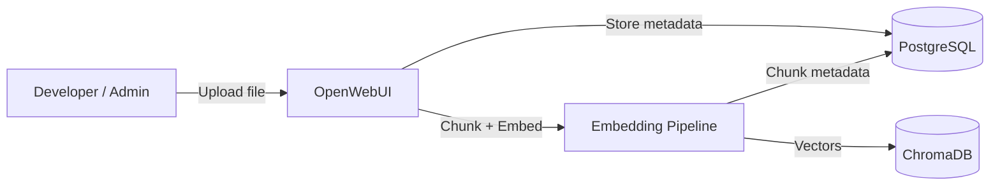
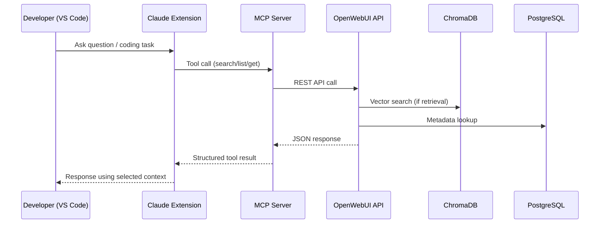

# work_rag — a self-hosted knowledge base for your own projects

A local RAG stack you run with `docker compose up`, plus an MCP server that lets
Claude query it from inside the editor. Nothing leaves the machine: documents,
embeddings and metadata all live in containers on localhost.

**It is general-purpose on purpose.** A collection is just a set of documents, so
the same stack holds whatever you need it to — a codebase's docs, hardware notes,
research papers, API references, meeting notes, a personal wiki. Add a collection,
point a tool at it, done. There is no schema to design and no project it is tied to.

## What problem it solves

Long-lived work loses context between sessions. The usual answers are bad in
opposite directions: paste everything into the prompt and pay for it every turn,
or paste nothing and re-derive what you already knew.

This stack is the third option. Documents are embedded once and retrieved on
demand, a few relevant chunks at a time, addressed by collection and file id. The
model asks for what it needs when it needs it.

## Stack

| Component | Role | Version |
| --- | --- | --- |
| OpenWebUI | ingestion, retrieval, chat UI, admin | `v0.11.3` |
| ChromaDB | vector storage and similarity search | `1.5.9` |
| PostgreSQL | collections, file metadata, config, chats | `15` |
| MCP server | tool interface for Claude (`mcp/openwebui-knowledge`) | local build |
| Embedding model | `BAAI/bge-m3` — 1024d, 8192-token context, multilingual | local, CPU |

Image tags are pinned in [docker-compose.yaml](docker-compose.yaml). Floating
tags like `:main` and `:latest` change silently under you; a pinned version means
an upgrade is a decision you make, not one that happens on the next `pull`.

## Quick start

```sh
cp .env.example .env          # fill in POSTGRES_*, WEBUI_ADMIN_*, WEBUI_SECRET_KEY
docker compose up -d
open http://localhost:3000    # create the admin account
```

Then, to let Claude reach it:

1. In OpenWebUI, enable **Settings → Admin → Users → Groups → Default
   permissions → Features → API Keys** (off by default — the create button
   returns 403 without it).
2. **Settings → Account → API Keys → Create.** Take the `sk-...` key, not the
   JWT shown above it: the JWT expires in four weeks and takes the integration
   down with it.
3. Put the key in `.env` as `OPENWEBUI_API_KEY`, set
   `OPENWEBUI_DEFAULT_COLLECTION` to the collection you query most, then
   `docker compose up -d --force-recreate openwebui-knowledge`.
4. Register the MCP server:

```sh
claude mcp add --scope user --transport http openwebui-knowledge http://localhost:8787/mcp
```

`WEBUI_SECRET_KEY` matters more than it looks: without a fixed value OpenWebUI
generates a new signing key on every restart and logs everyone out.

## Architecture

### Ingestion



| Component | Responsibility |
| --- | --- |
| OpenWebUI | Orchestrates ingestion and retrieval workflows |
| PostgreSQL | Stores collections, file metadata, and access data |
| ChromaDB | Stores embeddings and performs similarity search |

### Runtime



The MCP server speaks Streamable HTTP on `/mcp` and keeps the deprecated
HTTP+SSE transport on `/sse` for older clients.

## MCP tools

Every tool takes `collection` as either an id or a **name** — `"JIRA"` works
as well as the uuid, which matters because a model can produce a name and cannot
guess a uuid.

| Tool | Does |
| --- | --- |
| `ping_openwebui` | check the API is reachable and the key is valid |
| `list_collections` | collections, paged; `query` searches name, description and owner server-side |
| `list_documents` | files in a collection, plus what is still embedding and what failed |
| `get_document` | one file's text by `file_id`, a window at a time (`offset`, `next_offset`) |
| `select_context_files` | several files concatenated into one context block |
| `search_knowledge` | semantic search; `collection` or `collections` for several at once, `min_score` for the floor |
| `create_collection` | make a collection, or return the existing one of that name |
| `upload_document` | put text into a collection, by content |
| `upload_document_from_path` | the same, but the server reads the file off disk itself |
| `wait_pending` | block until a collection's embedding queue drains, or one file is linked |
| `dedupe_collection` | keep the newest file of each name, remove the rest; dry run by default |
| `remove_document` | take a file out of a collection — which also deletes it, see below |

Every tool is annotated (`readOnlyHint`, `destructiveHint`, `idempotentHint`), so
a client can tell the six read tools from the three that delete. Failures come
back as JSON with a `code` — `collection_not_found`, `collection_ambiguous`,
`processing_failed`, `openwebui_unreachable`, `openwebui_timeout`,
`openwebui_http`, `file_not_found`, `path_refused`, `invalid_argument` — so a
caller can branch on the failure instead of reading prose.

`search_knowledge` filters hits below `min_score` (default `OPENWEBUI_MIN_SCORE`,
0.76 unless set in `.env`). Each hit carries `score`, a similarity in [0,1] where
higher is better — the same number OpenWebUI confusingly returns as `distance`,
which is still emitted under that name for one release.
The floor is a property of the corpus, not of the stack: conversational text
scores systematically lower than curated prose, so pass `min_score` per call
rather than moving the default. Below the floor the tool says
`nothing_above_threshold` and reports `best_score_seen`, so a model can answer
"not in the knowledge base" instead of improvising from noise.

### Writing, and what "done" means

Uploads return as soon as OpenWebUI accepts them. Embedding continues in the
background, and **a file is linked to its collection only after it finishes** —
so a freshly uploaded document is briefly in neither `list_documents`' `files`
nor the search index. A document is therefore in exactly one of three states, and
`list_documents` reports all three:

- **`files`** — linked and searchable.
- **`pending`** — still embedding. Not a failure; retrying on it uploads the
  document twice.
- **`failed`** — extraction or embedding died. The file is in no other listing,
  `files/pending` excludes it by design, and uploading the same bytes again fails
  the same way. Read `error` for the reason.

That last one is why "absent from both other lists" cannot be read as "never
uploaded". `failed` is a bounded scan of the newest uploads, so it reports recent
failures rather than every historical one. `settled: false` on an upload means
"still embedding"; `failed: true` means the upload is over and it lost.

`wait_pending` is the way to wait for it: one blocking call until the queue is
empty, rather than a poll loop over `list_documents`. It defaults to 45 seconds
and caps at 55 — an MCP call over a bridge is cut at about 60, and the bridge's
own overhead takes several seconds of that, so 55 gets cut in practice. Call it
again if it returns `settled: false`.

`replace: true` cannot finish inside the call that asks for it. The previous
version may only be removed once the new one is linked — otherwise the collection
spends the whole embedding window with no copy of the document — and embedding a
160 KB file on CPU runs for minutes, well past any single RPC. So the replace
returns immediately with the old ids in `replace_pending`, and **the server
finishes the job on its own**, up to `OPENWEBUI_REPLACE_DEADLINE_MS` (15 min).
No second call, and no window in which both versions answer the same query. The
task lives in memory: if the process dies first the old version simply stays
attached, which is what used to happen every time.

**`settled: true` is not the same as "clean."** A replace that failed to remove
the old version, or never linked before its deadline, is *finished* — so it is
gone from `replace_pending` and the queue reads as empty. `wait_pending` also
returns `replace_done`, the last 20 finished replaces with their `linked` and
`detach_failed`, and sets `replace_incomplete` when one of them did not do
everything it promised. A server restart is the one case nothing can report:
that history is in memory too, so a replace interrupted by a restart leaves two
versions attached and no record of it. `dedupe_collection` with `dry_run: true`
is the check that does not depend on the process having stayed up.

`dedupe_collection` cleans up after exactly that: files sharing a name, newest by
`updated_at` kept, the rest removed. It is a dry run unless you pass
`dry_run: false`, and it skips any group whose two newest copies carry the same
timestamp rather than guessing which one is current.

Both upload tools skip work when nothing changed: they compare the sha256 of the
bytes being uploaded against `meta.file_hash` on what the collection already
holds, and return `unchanged: true` untouched. Note *which* digest: OpenWebUI's
`hash` column is the sha256 of the **extracted text**, not of the file, and it is
cleared to null when processing fails — comparing against it matches only where
extraction happens to be the identity.

**Removal is deletion.** `POST /knowledge/{id}/file/remove` takes `delete_file`
as a query parameter defaulting to `not ENABLE_KNOWLEDGE_FILE_RETENTION`, and
retention is off by default — so the call that reads as "detach" deletes the file
record and its blob. `remove_document` states the outcome rather than inheriting
it: it passes the flag explicitly and answers with `deleted_file`, and
`keep_file: true` unlinks without deleting. A file belonging to several
collections is deleted out of all of them.

The superseding paths — a `replace`, and `dedupe_collection` — leave the flag
unset and so follow the server's retention setting, which is what an operator who
turned retention on has asked for. With it off (the default) they delete, which is
what you want for a superseded version: the alternative fills `uploads` with
orphaned blobs. There is no undo either way, which is why `dedupe_collection` is
a dry run unless told otherwise and stops at `max_deletions` (20 by default).

### Reading files off disk

`upload_document_from_path` takes a path instead of content, so a large document
never has to travel through the conversation. A path parameter is otherwise
"ingest any file this server can reach", so it is gated by an allowlist:

```yaml
# docker-compose.override.yaml — gitignored, so host paths stay off the repo
services:
  openwebui-knowledge:
    volumes:
      - /absolute/host/dir:/uploads:ro
```

```sh
# .env
OPENWEBUI_UPLOAD_ROOTS=/uploads
```

**The default is empty, which refuses every path.** Roots are colon-separated
and are read *inside the container*, so the directory has to be mounted first —
and the path you pass is the container path (`/uploads/notes.md`), not the host
path it is mounted from. Paths are resolved with `realpath` before they are
compared, so a symlink or a `..` cannot climb out of a root. Refusals carry a
code — `no_roots`, `not_found`, `not_a_file`, `outside_roots`, `too_large` — and
name the readable roots, so a caller that guessed a host path can correct itself
without reading the compose file. An OpenWebUI failure carries its status
instead, so the caller can tell the two apart.

Deciding *which* files to send stays outside the server: manifests and hash locks
belong to whatever sync script owns the corpus.

```
run mcp**openwebui-knowledge**search_knowledge {
  "collection": "JIRA",
  "query": "incidents where pods crashed with OOM",
  "k": 8
}
```

Results carry `score`, `name` and `file_id`, so a retrieved chunk can always be
traced back to its file. There is no offset: the markdown header splitter this
stack runs leaves the chunk's `start_index` at 0 on every chunk, so reporting it
would only look like traceability it does not have.

## Exposure

Everything here is meant to run on one machine. Three things decide how much of
it a second machine — or a second process — can reach.

**Ports.** OpenWebUI is the only service worth publishing, and then only behind a
reverse proxy. ChromaDB has no authentication of its own and is bound to
`127.0.0.1` in `docker-compose.yaml` for that reason: OpenWebUI reaches it over
the compose network as `vector-db`, and published on every interface it is an open
vector store on the LAN. The MCP bridge is on `127.0.0.1:8787`.

**Origin.** `/mcp` refuses any request that carries an `Origin` header not listed
in `MCP_ALLOWED_ORIGINS` (empty by default). An MCP client sends no Origin at
all; a browser always does. That is what stops a page the user has open from
resolving its own hostname to `127.0.0.1` and talking to the bridge on their
behalf — the one attack a loopback bind does not prevent.

**Key scope.** An OpenWebUI `sk-...` key is the whole user, not a scope. On a
single-user stack, `ENABLE_API_KEY_ENDPOINT_RESTRICTIONS=true` plus
`API_KEYS_ALLOWED_ENDPOINTS` narrows every key on the instance to what this
server actually calls:

```sh
API_KEYS_ALLOWED_ENDPOINTS=/api/models,/api/v1/knowledge,/api/v1/files,/api/v1/retrieval/query
```

## Backup and restore

Two of these hold state you cannot regenerate, and one you can.

- **PostgreSQL** — metadata, collection membership, and the extracted text of every
  document (`file.data.content`). This is the source of truth.
- **`open_webui_data`** — the uploaded blobs, plus OpenWebUI's own files.
- **`chroma_data`** — vectors. Derived: they can be rebuilt from the text in
  Postgres, at the cost of a full re-embed.

```sh
# Back up. dumps/ is gitignored and the pre-commit hook refuses it by name.
mkdir -p dumps
docker compose exec -T postgres pg_dump -Fc -U "$POSTGRES_USER" "$POSTGRES_DB" > dumps/pg.dump
docker run --rm -v "${COMPOSE_PROJECT_NAME:-work-rag}_open_webui_data":/v -v "$PWD/dumps":/out \
    alpine tar czf /out/open_webui_data.tgz -C /v .
docker run --rm -v "${COMPOSE_PROJECT_NAME:-work-rag}_chroma_data":/v -v "$PWD/dumps":/out \
    alpine tar czf /out/chroma_data.tgz -C /v .
```

```sh
# Restore a volume. Stop the service first: untarring over a live SQLite file is
# how you turn one lost store into two.
docker compose stop vector-db
docker run --rm -v "${COMPOSE_PROJECT_NAME:-work-rag}_chroma_data":/v -v "$PWD/dumps":/in \
    alpine sh -c 'rm -rf /v/* /v/..?* 2>/dev/null; tar xzf /in/chroma_data.tgz -C /v'
docker compose up -d vector-db

# Restore Postgres into an empty database, then rebuild the vectors from it.
docker compose exec -T postgres pg_restore -c -U "$POSTGRES_USER" -d "$POSTGRES_DB" < dumps/pg.dump
```

**A volume only protects what the image actually writes into it.** Check the
mount against the image's own configuration after every tag bump — see the note
on `chroma_data` in `docker-compose.yaml`. A volume mounted on a path the process
ignores is invisible: the data lands in the container's writable layer, every
backup of the volume is empty, and the first `docker compose up` that recreates
the service deletes the store. The check is a measurement, not a reading: write
one document, `docker compose up -d --force-recreate <service>`, search for it
again.

### Rebuilding the vectors

The vectors are the one derived layer, so losing them is recoverable: the
extracted text of every document lives in Postgres. `tools/reindex.py` walks one
collection and re-embeds it a file at a time.

```sh
export OPENWEBUI_URL=http://127.0.0.1:3000
export OPENWEBUI_API_KEY=      # the sk-... key, same one the MCP server uses

python3 tools/reindex.py my-docs --limit 2     # try two files first
python3 tools/reindex.py my-docs
```

Use it rather than `POST /api/v1/knowledge/reindex`, which walks every collection
in a single synchronous request and **drops each collection's vectors before
refilling it** — so a run cut off by a client timeout leaves collections empty.
The per-file route (`POST /api/v1/files/{id}/data/content/update`) adds the new
vectors before removing the old ones and touches one collection at a time.

**A 200 from that route does not mean the file was embedded.** The handler
catches a processing exception, logs it, and answers successfully anyway; the
per-collection step below it only warns. Success has to be read back from the
file record's `data.status == "completed"`, which is what the script does and
what the `failed` list in `list_documents` surfaces afterwards. Treating the
status code as the answer is how a reindex reports a clean run over a collection
that is still empty.

Progress goes to `reindex-<collection>.jsonl` next to where you run it
(gitignored): a file recorded `ok` is skipped, so an interrupted pass resumes.
Re-embedding is CPU-bound and local — cost is heat and time, not tokens.

**The estimate is measured, not assumed.** Cost tracks file size, not file count,
and the rate per kilobyte moves several-fold between collections on one host, so
no constant survives the trip from one corpus to another. The script records each
file's size beside its time and switches to measured throughput once it has a
warmup behind it; the same numbers are what a later "why was this slow" starts
from.

**Watching a run you have no log for.** `updated_at` is stamped when a file
finishes embedding, so `list_documents` sorted by it — `order_by: updated_at`,
`direction: desc` — shows the top record moving while a reindex is working and
standing still once it is done. That is an external progress signal: it needs no
access to the script, and it measures the server rather than the runner.

### Is a collection intact?

Three checks, cheapest first. The first two cost one call each and catch the
failure that looks like nothing at all — every document listed, `failed` empty,
and no search result.

1. **Count the vector stores against the files.** OpenWebUI writes a `file-{id}`
   store per document, so the number of `file-*` collections in the vector
   database should match the collection's file count. A shortfall names how many
   documents are lost, not merely that something is.
2. **Ask whether the collection exists in the vector database at all**, under its
   own id. A knowledge collection with no store behind it is intact in Postgres
   and empty to every query.
3. **Run a probe query.** This is the one that catches a store that exists and is
   empty, and it is the only check that exercises the retrieval path end to end.

The embedding date is the fastest smell of the three: a collection whose newest
`updated_at` predates its newest content has not been embedded since that content
arrived.

## Designing collections

Retrieval injects only `top_k` chunks, so **corpus size never bloats the
context** — it is fixed at `top_k × chunk_size` no matter how large the
collection grows. What size costs you is competition: near-duplicate documents
crowd each other out of those few slots.

Two habits follow from that.

**Split by role, not by volume.** If a body of documents contains both "what is
true now" and "how it got that way", they answer the same query from two angles
and fight for the same slots. Two collections — one queried by default, one
queried on purpose — keeps each one's slots to itself.

**Keep artifacts atomic.** A 500 KB append-only log embedded whole produces
chunks that straddle two unrelated topics. Cut it along the structure it already
has — one section, one issue, one entry per artifact.

A consumer repo of this stack uses a sync tool built on this idea: it splits its
logs by heading and by dated row, hashes every artifact, and uploads only what
changed.

## Retrieval settings that matter

Found by measurement on this stack; the defaults are not good for every corpus.

- **Embedding model.** The stock `all-MiniLM-L6-v2` is English-only with a
  256-token limit. Russian costs ~1.19 characters per token against 3.64 for
  English, so at `chunk_size 1000` about 70% of every Russian chunk went
  unembedded — silently. `bge-m3` removes both limits.
- **`ENABLE_RAG_HYBRID_SEARCH`** defaults to off, and while it is off the API
  ignores `hybrid: true` without an error. On, BM25 recovers exact terms
  (identifiers, parameter names, issue numbers) that pure vector search misses.
  There is no per-query switch either way: with the flag on, the branch that
  handles `hybrid: false` re-checks the same flag and runs hybrid search anyway,
  just with the global parameters instead of the call's. So `search_knowledge`
  exposes the knobs (`rerank.k_reranker`, `rerank.r`, `rerank.bm25_weight`) and
  leaves the switch where it actually lives, with the operator.
- **A vector store is pinned to its model's dimension.** Changing the embedding
  model makes every later write fail with `expecting embedding with dimension of
  384, got 1024`. The collection has to be dropped and refilled.
- **`RELEVANCE_THRESHOLD` defaults to 0.0**, so retrieval always returns
  `top_k` chunks even when nothing is relevant — "no sources found" becomes
  unreachable, which quietly breaks any prompt that branches on it.

## Token behaviour

| Consumes tokens | Does not |
| --- | --- |
| Claude input and output | OpenWebUI retrieval (unless it calls its own LLM) |
| Tool results — a tool response joins the context | ChromaDB similarity search |
| | PostgreSQL lookups |

Embeddings are computed locally on CPU, so indexing costs time rather than money.

## Repo layout

| Path | What |
| --- | --- |
| [docker-compose.yaml](docker-compose.yaml) | the stack, with pinned image tags |
| [mcp/openwebui-knowledge/](mcp/openwebui-knowledge/src/index.ts) | the MCP server (TypeScript) |
| [prompts/system-prompt.md](prompts/system-prompt.md) | knowledge-first system prompt used in the chat UI |
| `.env` | credentials and per-deployment settings (gitignored) |

## Summary

A local, general-purpose knowledge base with an IDE-native way in. It gives you
structured knowledge access, deterministic references by collection and file id,
controlled context size, and a clean split between storage, retrieval and
reasoning — without shipping your documents anywhere or paying prompt tax for
context you are not using.
