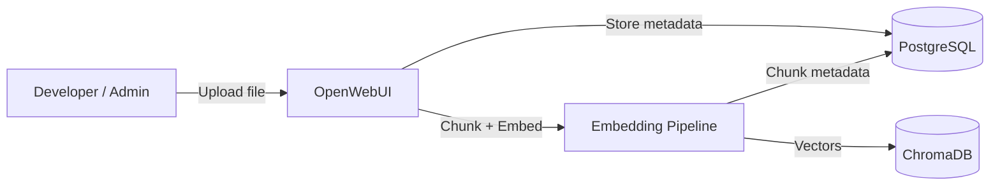
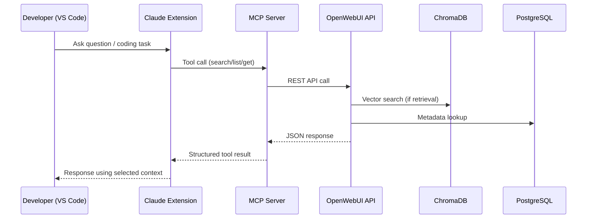

# VS Code Claude extension + OpenWebUI Knowledge Integration

## Overview

This setup connects:

- Claude (VS Code extension)
- MCP server (Model Context Protocol)
- OpenWebUI
- ChromaDB (vector storage)
- PostgreSQL (metadata storage)

**It enables structured, on-demand knowledge retrieval directly inside the coding workflow**

## Architecture

### 1. Knowledge Ingestion Flow



**Responsibilities**

| Component  | Responsibility                                     |
| ---------- | -------------------------------------------------- |
| OpenWebUI  | Orchestrates ingestion and retrieval workflows     |
| PostgreSQL | Stores collections, file metadata, and access data |
| ChromaDB   | Stores embeddings and performs similarity search   |

### 2. Runtime Flow (Claude + MCP)



**List tools from Claude VS code extension**


## Typical Usage Workflow

### 1. List Knowledge Collections

```
run mcp**openwebui-knowledge**list_collections
Returns:
name, id
```

### 2. List Documents in a Collection

```sh
run mcp**openwebui-knowledge**list_documents <collection_id>
Returns:
file_id, file_name, size
```

### 3. Retrieve a Specific Document

```
run mcp**openwebui-knowledge**get_document { "file_id": "..." }
```

### 4. Search Knowledge via Vector Retrieval

```
run mcp**openwebui-knowledge**search_knowledge {
"collection": "...",
"query": "...",
"k": 8
}
```

Returns top-K relevant chunks.

### 5. Attach Multiple Files as Context

```
run mcp**openwebui-knowledge**select_context_files {
"file_ids": ["id1", "id2"]
}
```

This aggregates selected documents for coding context.

## Token & Cost Behavior

**Tokens ARE consumed**

- Claude input tokens
- Claude output tokens
- Tool result tokens (tool response becomes part of context)

**Tokens are NOT consumed**

- For OpenWebUI retrieval (unless OpenWebUI calls its own LLM)
- For ChromaDB similarity search
- For PostgreSQL lookups

## Key Benefits

### 1. Controlled Context Size

Only requested documents or chunks are injected into the model context.

**This avoids:**

- Large static prompts
- Repeated documentation injection
- Excessive token waste

### 2. Deterministic Knowledge References

Specific documents are referenced via:

- collection_id
- file_id

This guarantees reproducibility.

### 3. On-Demand Retrieval

**Instead of embedding the entire knowledge base into prompts:**

- Retrieve only what is needed
- Retrieve only relevant sections
- Limit chunk count (k)
- Limit max characters per file

### 4. Separation of Concerns

| Layer      | Responsibility                    |
| ---------- | --------------------------------- |
| OpenWebUI  | Knowledge ingestion and retrieval |
| MCP        | Tool interface layer for Claude   |
| Claude     | Reasoning and response generation |
| ChromaDB   | Vector similarity search engine   |
| PostgreSQL | Metadata and collection storage   |

### 5. IDE-Native Workflow

No external dashboards required.

Everything is accessible from:

- VS Code
- Claude extension
- MCP tools

## Recommended Best Practices

- Keep documents modular (avoid monolithic 200k files)
- Use structured headings for better section targeting
- Retrieve specific sections rather than full files
- Limit `k` to reduce token load
- Use context aggregation only when necessary

## Summary

**This integration provides:**

- Structured knowledge access
- Reduced token overhead
- Deterministic context control
- Clean separation of responsibilities
- Scalable architecture for RAG-driven development

It enables knowledge-driven coding without bloating prompt size or losing control over context boundaries.